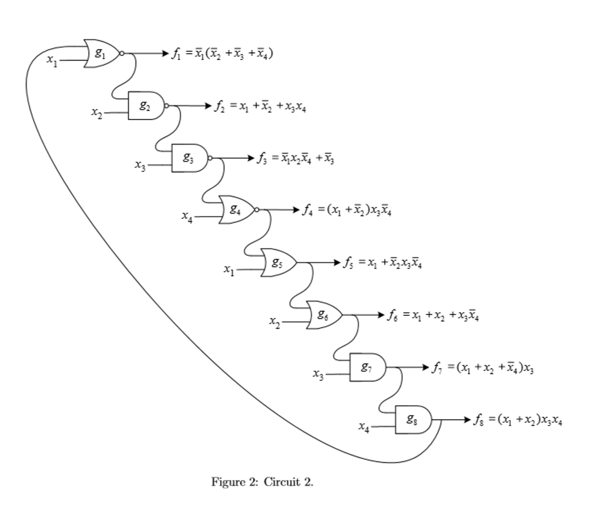

# Logic circuit timing analysis utility
* Create arrival time table for a given logic circuit
* Allow multi function definitions
* Allow defining logic function in term of other functions
Read the Circuit Description file or the instruction below to know how to describe the logic circuit to the computer <br/>
```
# Lines starting with # are comments
#===================Define=Variables====================
# Variable name INCLUDING function name separate by comas , form = letters (and or number) no space, Function name set to u

var_name{var0_name=initial_value,var1_name=initial_value,...}	
func_name{func0_name,func_1_name}	

#===================Define=Functions====================
#Function name same requirement as variable names

delay,func0_name=And(XOR(var0_name,var1_name,..),OR(var1_name,var2_name))	#define the function
delay,func1_name=....

```
An example how to create a description file given below <br/>
<br/>



```
var_name{x1=1,x2=1,x3=1,x4=1}
func_name{f1,f2,f3,f4,f5,f6,f7,f8}
1,f1=NOR(x1,f8)
1,f2=NAND(x2,f1)
1,f3=NAND(x3,f2)
1,f4=NOR(f3,x4)
1,f5=OR(x1,f4)
1,f6=OR(x2,f5)
1,f7=AND(x3,f6)
1,f8=AND(f7,x4)
```
To run the timing analysis:
* Save the description into a file with your choice of name
* Modify the path in main.py to point to your file
* Run python3 main.py in this folder to obtain the arrival time table
